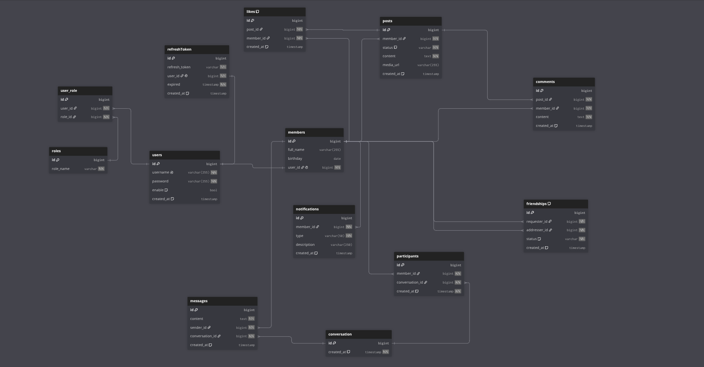
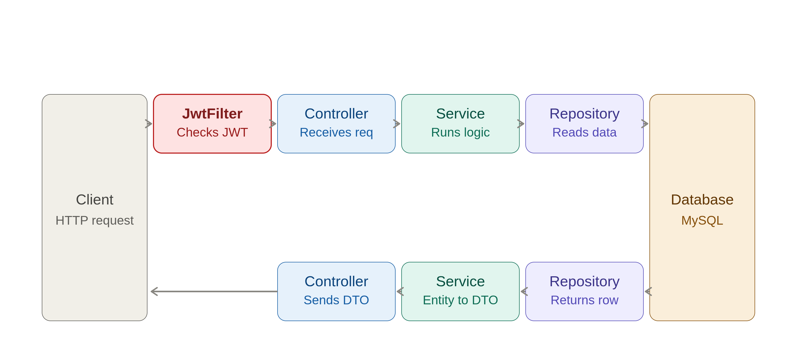

# 🌐 Social Connect — Backend


> ⚠️ **This project is currently under active development.**

## 📖 Overview

This is the **Backend API** for **Social Connect** — a social networking app that lets users add friends, chat, create posts, and interact with each other. This repository provides all the REST APIs consumed by the Frontend.

🔗 Frontend repo: [social-connect-frontend](https://github.com/LyThaiBao/social_app-FE-)

## ✨ Key Features

- 🤝 **Friendship system** — send/manage friend requests, member listings
- 💬 **Real-time messaging** — conversations & messages powered by WebSocket (STOMP)
- 🔔 **Notifications** — real-time notifications for user activity
- 📝 **Posts** — create, update, and delete posts
- ❤️ **Likes** — react to posts
- 💭 **Comments** — discuss under posts
- ☁️ **Media upload** — image/media upload via Cloudinary

## 🛠️ Tech Stack

| Layer | Technology |
|---|---|
| **Language** | Java 21 |
| **Framework** | Spring Boot 4.0.2 |
| **Database** | MySQL (Spring Data JPA) |
| **Security** | Spring Security, JWT (`jjwt` 0.11.5) |
| **Real-time** | Spring WebSocket + STOMP messaging |
| **Media Storage** | Cloudinary |
| **Tools** | Git, GitHub, Docker (containerized MySQL), Lombok |

## 🏗️ Architecture Highlights

- 🔐 **JWT-based authentication** — stateless auth via a custom `JwtFilter`, with a dedicated `JwtAuthenticationEntryPoint` for handling auth exceptions outside the controller layer
- 🔄 **Token Rotation** — refresh token rotation mechanism to reduce token theft risk
- 🧱 **Stateless session policy** — `SessionCreationPolicy.STATELESS`, no server-side session state
- 🌐 **CORS configuration** — centralized `CorsConfigurationSource` bean supporting credentials across origins
- 🔌 **Real-time communication** — WebSocket/STOMP endpoints (`/ws/**`) for live messaging and notifications
- ⚡ **Query Optimization**:
  - Uses **`JOIN FETCH`** to solve the **N+1 query problem**
  - Applies **Batch Size** to batch queries and reduce database round-trips

## 🗂️ Database Schema (ERD)




## 🏛️ Architecture Flow


A request flows down through the layers — **Controller** receives it, **Service** runs the business logic, **Repository** reads from the **Database**. On the way back, the **Service** layer maps the raw database entity into a **DTO** before it's returned through the Controller to the client, so internal entities are never exposed directly in the API response.

## 📡 API Endpoints (summary)

| Method | Endpoint | Auth Required | Description |
|---|---|---|---|
| * | `/api/auth/**` | ❌ Public | Register, login, refresh token |
| * | `/ws/**` | ❌ Public | WebSocket handshake for real-time messaging |
| GET | `/api/me/**` | ❌ Public | Current user info |
| GET | `/api/members/**` | ✅ | List / search members |
| POST | `/api/friendship/**` | ✅ | Send / manage friend requests |
| GET, POST | `/api/conversations/**` | ✅ | Manage conversations |
| GET, POST | `/api/messages/**` | ✅ | Send & retrieve messages |
| POST, DELETE | `/api/notifications/**` | ✅ | Create / remove notifications |
| GET, POST, PATCH, DELETE | `/api/posts/**` | ✅ | Create, read, update, delete posts |
| GET, POST | `/api/likes/**` | ✅ | Like / unlike posts |
| GET, POST | `/api/comments/**` | ✅ | Comment on posts |
| POST | `/api/cloud/**` | ✅ | Upload media (Cloudinary) |

> 📌 Endpoints marked ✅ require a valid JWT access token in the `Authorization` header.

## 🚀 How to Run Locally

### 1. Clone the repository
```bash
git clone https://github.com/LyThaiBao/Social_App.git
cd Social_App
```

### 2. Start MySQL with Docker
```bash
docker run --name social-mysql -e MYSQL_ROOT_PASSWORD=yourpassword -e MYSQL_DATABASE=social_connect -p 3306:3306 -d mysql:8.0
```

### 3. Configure environment variables

Create an `application.properties` (or `application.yml`) file based on the `.env.example` template:
```env
spring.datasource.url=jdbc:mysql://localhost:3306/social
spring.datasource.username=root
spring.datasource.password=your_password
cloudinary.apiName=your_api_name
cloudinary.apiKey=your_api_key
cloudinary.apiSecret=your_api_secret
jwt.secretKey=your_secret_key

# Spring allows file uploads <=1MB by default, so we expand it here
spring.servlet.multipart.max-file-size=500MB
spring.servlet.multipart.max-request-size=500MB
```

> Requires **Java 21** and **Maven** (or use the bundled `./mvnw` wrapper).

### 4. Run the application
```bash
./mvnw spring-boot:run
```

The API will be available at: `http://localhost:8080/api`

## 📄 License

All rights reserved by Timmy.